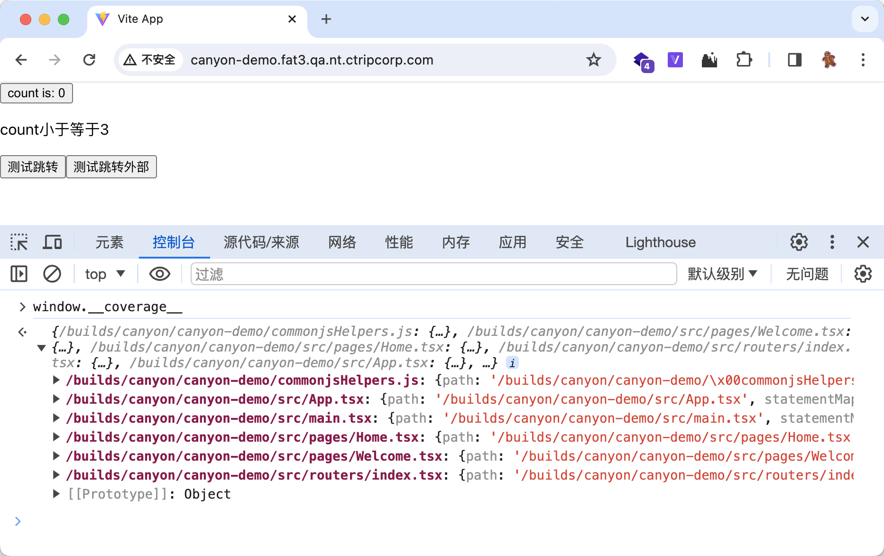

前言

## 架构

Canyon的整体技术栈完全基于nodejs（前端、后端、任务、上报器），部署非常简便，仅需要nodejs环境，也适用于云原生环境部署（docker、Kubernetes）。应用整体流程为：代码探针插桩、触发器触发探针、覆盖率数据上报、消息生成覆盖率概览、覆盖率报告呈现。应用的架构设计适用于高频、大体积覆盖率数据的上报，使用分布式部署，消息队列消费。

## 代码插桩（instrumenting-code）

istanbul是久经沙场的js代码插桩黄金标准，Canyon主要为端到端测试提供解决方案，经过大量的实验验证，现代化前端工程的覆盖率插桩必须要编译时插桩。具体原因是istanbuljs提供的nyc插桩工具只能对原生js进行插桩，然而前端模版语法层出不穷，例如ts、tsx、vue，虽然nyc也可以插桩，但是结构实践证明直接插桩的覆盖率效果不尽人意，无法精确到该插桩到的函数、语句、分支。幸运的是经过调研，我们发现了[babel-plugin-istanbul](https://github.com/istanbuljs/babel-plugin-istanbul)、vite-plugin-istanbul（experimental）、swc-plugin-coverage-instrument(experimental)。等类型工程的插桩解决方案。这些方案无一例外都是在前端工程编译阶段在将代码分析成ast抽象语法树的时候在适当时机进行插桩方法调用，更精确的插桩到的函数、语句、分支。

适用的工程类型：

| 工程类型         | 方案                   |
|--------------|----------------------|
| 原生JavaScript | nyc instrument |
| babel        | babel-plugin-istanbul |
| swc          | swc                  |
| vite         | vite                 |

用户可以根据自己的工程类型选择合适的插桩方案，只需要在工程中安装对应的插件，然后就会在编译时自动插桩。

插桩完成后，代码中会插入一些代码探针，这些代码探针会在运行时收集覆盖率数据，然后上报到Canyon服务端。

检查是否插桩成功，可以在编译后的产物中搜索`__coverage__`，如果有则说明插桩成功。

为了紧密关联插桩代码的源代码，我们适配了各种provider，将环境变量发送到Canyon服务端，兑换到reportID，方便覆盖率数据聚合计算完成后的覆盖率源文件的关联展示。

我们还提供了babel-plugin-canyon的babel插件，可以在各种流水线内（aws，gitlab ci）读取环境变量(branch、sha)，以供后续覆盖率数据与对应的gitlab源代码关联。provider，提供商

需要特别注意的是，代码探针的插桩会在构建产物上下文加上代码探针，会是代码整体产物增大30%，建议不要上生产环境。

## 触发器（trigger）

chrome插件

## 报告

## 社区推广

## 参考链接

