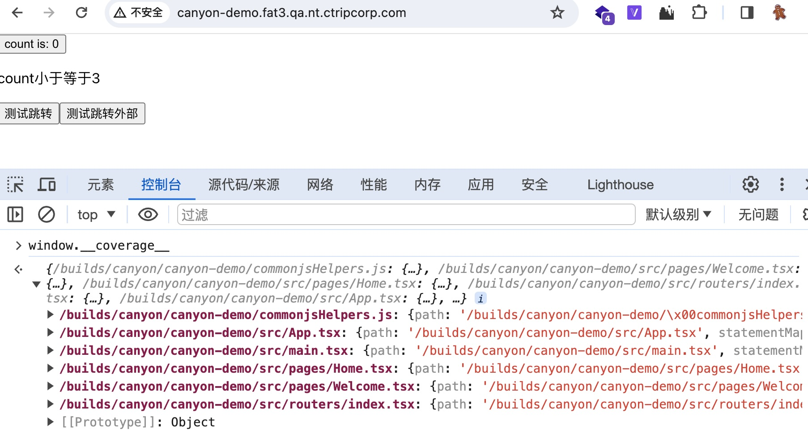

# 开源 | Canyon: 提升JavaScript代码质量的全面覆盖率分析工具

## 背景

[istanbuljs](https://github.com/istanbuljs/istanbuljs) 是一款出色的 JavaScript 代码覆盖率工具，通常用于单元测试中的代码覆盖率检测，并结合本地覆盖率数据生成静态报告。然而，随着现代前端技术的发展，特别是 UI 自动化测试的兴起，对端到端测试的代码覆盖率检测需求日益增加。这种需求包括测试执行时覆盖率高并发上报、实时覆盖率聚合以及覆盖率数据水合展示等功能。

为此，我们在 istanbuljs 的基础上开发了一套全面提升 JavaScript 代码质量的覆盖率分析工具 Canyon。Canyon 不仅能够处理高并发的覆盖率上报，实时聚合，还能提供覆盖率报告的水合展示。目前，携程的机票、酒店、IBU 和商旅等部门已经开始使用 Canyon，并在持续集成流水线构建阶段插入代码，以便在 UI 自动化测试阶段收集上报覆盖率数据。最终，在 Canyon 服务端生成详尽的覆盖率报告，为 UI 自动化测试用例提供全面的覆盖率数据指标。


## 介绍

Canyon 采用简单的 Babel 插件配置即可实现代码插装、覆盖率上报和实时报告生成。其技术栈完全基于 JavaScript，只需 Node.js 环境即可运行，部署方便，适用于云原生环境的部署（如 Docker、Kubernetes）。

应用的架构设计特别适用于处理高频、大规模的覆盖率数据上报，能够应对 UI 自动化测试中的各种场景。同时，Canyon 与现有的 CI/CD 工具（如 GitLab CI、Jenkins）无缝集成，使用户能够轻松地在持续集成流水线中使用。

下面我会根据以下几个部分来介绍 Canyon 的主要功能：

1. 代码覆盖率
2. 代码插桩
3. 测试与上报
5. 覆盖率聚合
6. 变更代码覆盖率

## 代码覆盖率

随着你编写更多的end-to-end测试case，你会发现自己有一些疑问，我需要写更多的测试用例吗？究竟还有哪些代码没测到？用例会不会重复了？这个时候代码覆盖率就派上用场了，它的原理是在代码执行前将代码探针插入到源代码中（其实就是上下文加计数器），这样每当case执行的时候就可以触发其中的计数器.

在代码中插入代码探针的步骤称为**代码插桩**（instrument）。插桩前的代码：

```js
// add.js
function add(a, b) {
  return a + b
}
module.exports = { add }
```

插桩过程是对代码解析以查找所有函数、语句和分支，然后将计数器插入代码中。对于上面的代码，插桩完成后：

```js
// 这个对象用于计算每个函数和每个语句被执行的次数
const c = (window.__coverage__ = {
  // "f" 记录每个函数被调用的次数
  f: [0],
  // "s" 记录每个语句被调用的次数
  // 我们有3个语句，它们都从0开始
  s: [0, 0, 0],
})

// 第一个语句定义了函数
c.s[0]++
function add(a, b) {
  // 函数被调用后是第二个语句
  c.f[0]++
  c.s[1]++

  return a + b
}
// 第三个语句即将被调用
c.s[2]++
module.exports = { add }

```

我们希望确保文件中的每个语句和函数`add.js`都已被我们的测试至少执行一次。因此我们编写一个测试：

```js
// add.cy.js
const { add } = require('./add')

it('adds numbers', () => {
  expect(add(2, 3)).to.equal(5)
})
```

当测试调用时`add(2, 3)`，执行“add”函数内的计数器递增，覆盖范围对象变为：

```js
{
  f: [1],
  s: [1, 1, 1]
}
```

这个测试用例覆盖率达到了100%，每个函数和每个语句都至少执行了一次。但是在实际应用中，要达到100%的代码覆盖率需要多次测试。

## 代码插桩（instrumenting-code）

istanbuljs 是久经沙场的js代码插桩黄金标准，Canyon主要为端到端测试提供解决方案，经过大量的实验验证，现代化前端工程的覆盖率插桩必须要编译时插桩。具体原因是istanbuljs提供的nyc插桩工具只能对原生js进行插桩，然而前端模版语法层出不穷，例如ts、tsx、vue，虽然nyc也可以插桩，但是结构实践证明直接插桩的覆盖率效果不尽人意，无法精确到该插桩到的函数、语句、分支。幸运的是经过调研，我们发现了[babel-plugin-istanbul](https://github.com/istanbuljs/babel-plugin-istanbul)、vite-plugin-istanbul（experimental）、swc-plugin-coverage-instrument(experimental)。等类型工程的插桩解决方案。这些方案无一例外都是在前端工程编译阶段在将代码分析成ast抽象语法树的时候在适当时机进行插桩方法调用，更精确的插桩到的函数、语句、分支。

适用的工程类型：

| 工程类型         | 方案                   |
|--------------|----------------------|
| vanilla javascript | [nyc](https://github.com/istanbuljs/nyc) |
| babel        | [babel-plugin-istanbul](https://github.com/istanbuljs/babel-plugin-istanbul) |
| vite      | [vite-plugin-istanbul](https://github.com/ifaxity/vite-plugin-istanbul) (experimental) |
| swc      | [swc-plugin-coverage-instrument](https://github.com/kwonoj/swc-plugin-coverage-instrument) (experimental) |

用户可以根据自己的工程类型选择合适的插桩方案，只需要在工程中安装对应的插件，然后就会在编译时自动插桩。

以babel.config.js为例：

```javascript

module.exports = {
  plugins: [
    [
      'babel-plugin-istanbul',
      {
        exclude: ['**/*.spec.js', '**/*.spec.ts', '**/*.spec.tsx', '**/*.spec.jsx'],
      },
    ],
  ],
};

```

插桩完成后，代码中会插入一些代码探针，这些代码探针会在运行时收集覆盖率数据，然后上报到Canyon服务端。

检查是否插桩成功，可以在编译后的产物中搜索`__coverage__`，如果有则说明插桩成功。




为了紧密关联插桩代码的源代码，我们适配了各种provider，将环境变量发送到Canyon服务端，兑换到reportID，方便覆盖率数据聚合计算完成后的覆盖率源文件的关联展示。

我们还提供了babel-plugin-canyon的babel插件，可以在各种流水线内（aws，gitlab ci）读取环境变量(branch、sha)，以供后续覆盖率数据与对应的gitlab源代码关联。provider，提供商

babel.config.js

```javascript
module.exports = {
  plugins: [
    [
      'babel-plugin-istanbul',
      {
        exclude: ['**/*.spec.js', '**/*.spec.ts', '**/*.spec.tsx', '**/*.spec.jsx'],
      },
    ],
  ],
};
```

支持的提供商：


| 提供商                                                       |
| ------------------------------------------------------------ |
| [Azure Pipelines](https://azure.microsoft.com/en-us/services/devops/pipelines/) |
| [CircleCI](https://circleci.com/)                            |
| [Drone](https://drone.io/)                                   |
| [Github Actions](https://github.com/features/actions)        |
| [GitLab CI](https://about.gitlab.com/gitlab-ci/)             |
| [Jenkins](https://jenkins.io/)                               |
| [Travis CI](https://travis-ci.org/)                          |


需要特别注意的是，代码探针的插桩会在构建产物上下文加上代码探针，会是代码整体产物增大30%，建议不要上生产环境。


## 测试与上报

当插桩完成发布到测试环境后，我们就可以进行端到端测试了，拿playwrite举例，对于插桩成功的前端应用站点，他们的window对象上面都会挂载__coverage__和canyon对象，我们需要对在playwright测试工具中，在测试用例执行过程中


，我们就可以开始测试阶段了。端到端测试我们以[playwright](https://playwright.dev/)为例。

```js
const {chromium} = require('playwright');
const main = async () => {
  const browser = await chromium.launch()
  const page = await browser.newPage();
  // 进入被测页面
  await page.goto('http://test.com')
  // 执行测试用例
  // 用例1
  await page.click('button')
  // 用例2
  await page.fill('input', 'test')
  // 用例3
  await page.click('text=submit')
  const coverage = await page.evaluate(`window.__coverage__`)
  console.log(coverage)
  browser.close()
}

main()

```

当测试用例执行完成后，对于单页面应用(SPA)或者多页面应用而言，上报步骤是将页面window对象上的__coverage__对象上报到Canyon服务端，对于单页面应用来说，相对来说比较简单，在所有测试内容都在单页面应用内，覆盖率数据会常驻在window对象中，对于多页面应用而言，路由的跳转会导致window对象的重制，丢失coverage对象。所以这个时机是至关重要的，经过大量实践验证，我们找到了浏览器的on visible change方法

以下是关于 `visibilitychange` 事件的浏览器兼容性报告，已移除兼容性列：

在浏览器可见性改变的时候上报覆盖率数据，值得一提的是，对于visibilitychange这种可能会导致重复数据上报，但是对于覆盖率统计来说，未执行到的代码多次合并来说不回影响覆盖率的具体指标数据统计。

对于高并发的测试场景，建议使用case本地聚合后上报覆盖率数据的方法，这样可以极大减少Canyon服务端数据处理压力。

```js
/**
 * 合并两个相同文件的文件覆盖对象实例，确保执行计数正确。
 *
 * @method mergeFileCoverage
 * @static
 * @param {Object} first 给定文件的第一个文件覆盖对象
 * @param {Object} second 相同文件的第二个文件覆盖对象
 * @return {Object} 合并后的结果对象。请注意，输入对象不会被修改。
 */
function mergeFileCoverage(first, second) {
  const ret = JSON.parse(JSON.stringify(first));

  delete ret.l; // 移除派生信息

  Object.keys(second.s).forEach(function (k) {
    ret.s[k] += second.s[k];
  });

  Object.keys(second.f).forEach(function (k) {
    ret.f[k] += second.f[k];
  });

  Object.keys(second.b).forEach(function (k) {
    const retArray = ret.b[k];
    const secondArray = second.b[k];
    for (let i = 0; i < retArray.length; i += 1) {
      retArray[i] += secondArray[i];
    }
  });

  return ret;
}
```


合并完以后，再playwright里构建fetch请求发送数据

```js
fetch
```


上报时机

Chrome 浏览器引入的新 JavaScript API——fetchLater ()，可在用户关闭页面或导航至其他页面时安全发送网络请求。

> 注：fetchLater() 已在 Chrome 中提供，用于在版本 121（2024 年 1 月发布）开始的原始试验中供真实用户测试，该试验将持续到 Chrome 126（2024 年 7 月）。

## 聚合

端到端测试的覆盖率数据特点之一是单体数据体积大，在项目整体插桩的情况下相当于整体源代码体积的30%，并且携程Trip.com flight站点的预定页UI自动化case触发visibilitychange的次数可达到近千次，对于单条数据大且高频次的数据上报场景，很难做到实时数据聚合计算。Canyon采用消息队列的形式来消费聚合数据。并且设计成无状态服务，适用于云原生时代的容器化部署，可通过HPA弹性伸缩容来应用不同场景下的测试覆盖率上报。


消息队列随机抽取消费

```sql
SELECT * FROM coverage WHERE cov_type = 'normal' AND consumer = 1 ORDER BY random() LIMIT 1
```

加分布式锁限制消费


## 报告

对于覆盖率报告展示，我们沿用了istanbul-report的界面风格，但是由于istanbul-report只提供了静态html文件的生成，不适合现代化前端水合数据生成html的模式，为此我们参考了他的源码，使用了shiki（语法高亮器）标记源代码覆盖率，根据istanbul- report的标记方法。

```js
import { codeToHtml } from 'shiki';

codeToHtml(code, {
        theme: theme === 'light' ? 'light-plus' : 'tokyo-night',
        lang: filePath.split('.').pop() as string,
        decorations: decorationsLv2Array.map(([line, startCol, endCol]) => {
          return {
            start: {
              line: line,
              character: startCol - 1 < 0 ? 0 : startCol,
            },
            end: {
              line: line,
              character: endCol - 1 < 0 ? 0 : endCol,
            },
            properties: { class: 'highlighted-word' },
          };
        }),
      })
```


## 变更代码覆盖率

对于变更代码覆盖率，我们统计的公式是 覆盖到的新增代码行/所有新增代码行，通过配置compareTarget来指定对比目标，再通过变更代码行的获取我们通过gitlab的接口，和jsdiff可以计算得出sha和compareTarget对比出来每个文件的变更行的行号，再通过 覆盖到的新增代码行/所有新增代码行 的公式计算。

```js
/**
 * returns computed line coverage from statement coverage.
 * This is a map of hits keyed by line number in the source.
 */
function getLineCoverage(statementMap:{ [key: string]: Range },s:{ [key: string]: number }) {
  const statements = s;
  const lineMap = Object.create(null);

  Object.entries(statements).forEach(([st, count]) => {
    if (!statementMap[st]) {
      return;
    }
    const { line } = statementMap[st].start;
    const prevVal = lineMap[line];
    if (prevVal === undefined || prevVal < count) {
      lineMap[line] = count;
    }
  });
  return lineMap;
}

```


## 社区推广

从这篇文章发表时起，我们将正式开源Canyon项目。JavaScript是时下最流行的编程语言，但是端到端测试覆盖率收集领域一直空白，我们的代码开发基于了Istanbuljs，shiki等优秀开源项目，我们有信心推出canyon开源可以赢得社区的反响，并且可以有大量js开发者参与进来。

我们基于的时istanbuljs的代码插桩，对于javascript语言领域而言，istanbuljs可谓是久经沙场，如果可以投入生产实践插桩收集，将会在代码质量优化方面提供非常重要的指标参考。

Canyon在未来还有很大发展空间，例如生产环境插桩收集还未验证，与playwright puppeteer cypress等自动化测试的工具还没有深度链接，这些都已经规划到了未来的开发计划中。希望在未来Canyon可以在携程及社区有更多人参与建设。

## 参考链接

**开源项目 Canyon：**

https://github.com/canyon-project/canyon

**JavaScript覆盖率工具：**

https://github.com/istanbuljs/istanbuljs

**Shiki美观而强大的语法高亮器：**

https://github.com/shikijs/shiki

**JavaScript 文本差异：**

https://github.com/kpdecker/jsdiff

**"An O(ND) Difference Algorithm and its Variations" (Myers, 1986).**

http://www.xmailserver.org/diff2.pdf
