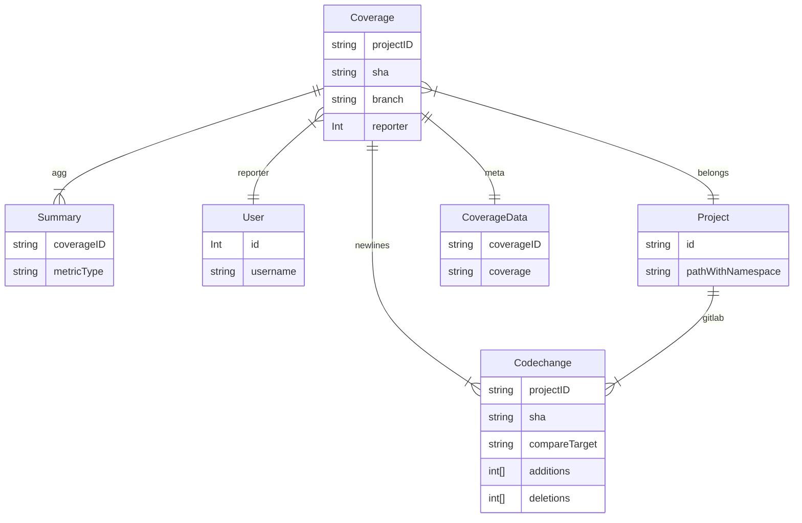

```mermaid
erDiagram
    coverage[Coverage] {
        string projectID
        string sha
        string branch
        Int reporter
    }
    summary["Summary"] {
        string coverageID
        string metricType
    }
    user["User"] {
        Int id
        string username
    }
    project["Project"] {
        string id
        string pathWithNamespace
    }
    codechange["Codechange"] {
        string projectID
        string sha
        string compareTarget
        int[] additions
        int[] deletions
    }
    coveragedata[CoverageData] {
        string coverageID
        string coverage
    }
    
    coverage ||--|| coveragedata : meta
    coverage ||--|{ summary : agg
    coverage ||--|{ codechange : newlines
    coverage }|--|| project : belongs
    coverage }|--|| user : reporter
    project ||--|{ codechange : gitlab
```