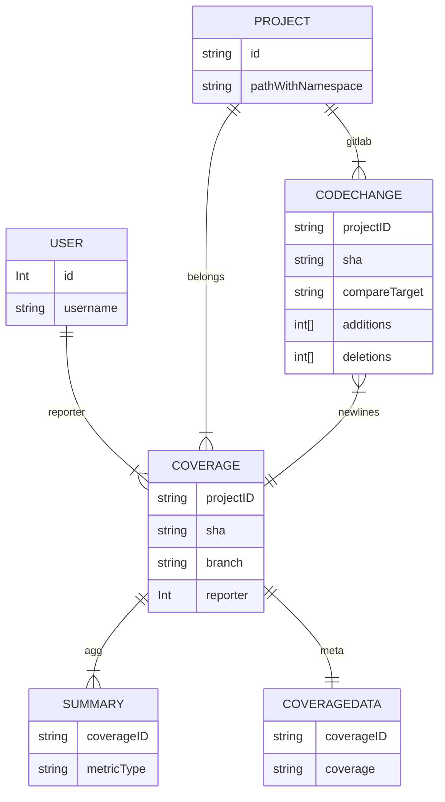

```mermaid
erDiagram
    COVERAGE ||--|{ SUMMARY : agg
    COVERAGE {
        string projectID
        string sha
        string branch
        Int reporter
    }
    SUMMARY {
        string coverageID
        string metricType
    }
    USER ||--|{ COVERAGE : reporter
    USER {
        Int id
        string username
    }
    PROJECT ||--|{ COVERAGE : belongs
    PROJECT {
        string id
        string pathWithNamespace
    }
    CODECHANGE }|--|| COVERAGE : newlines
    CODECHANGE {
        string projectID
        string sha
        string compareTarget
        int[] additions
        int[] deletions
    }
    COVERAGE ||--|| COVERAGEDATA : meta
    COVERAGEDATA {
        string coverageID
        string coverage
    }
    PROJECT ||--|{ CODECHANGE : gitlab
```